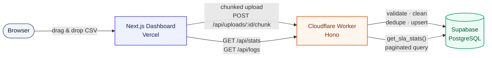

# SLA Monitor

A single-screen observability dashboard that turns messy, multi-agent health-check CSVs into a
trustworthy SLA availability number — the kind that automatically decides a billing credit. Upload
a CSV, it's parsed/validated/cleaned by a real deployed serverless function, persisted to Postgres,
and the dashboard queries that data live.

**Live app:** https://sla-monitoring-dashboard-web.vercel.app/
**Worker API:** https://sla-monitoring-worker.sla-worker.workers.dev
**Repo:** https://github.com/sunny-pixels/sla-monitoring-dashboard

> Last verified live: **2026-09-22** — uploaded a fixture through the live UI, confirmed processing,
> confirmed the dashboard reads it back after a hard refresh. See [Known limitations](#known-limitations)
> for the one thing that could take it down between reviews (Supabase's free-tier pause) and exactly
> how to bring it back.

---

## Table of contents

1. [Overview](#overview)
2. [Architecture — what runs where, and why](#architecture--what-runs-where-and-why)
3. [Database schema](#database-schema)
4. [Data findings](#data-findings)
5. [SLA calculation](#sla-calculation)
6. [Assumptions](#assumptions)
7. [Incident JSON](#incident-json)
8. [Local development](#local-development)
9. [Environment variables](#environment-variables)
10. [Database setup](#database-setup)
11. [Cloudflare Worker setup & deployment](#cloudflare-worker-setup--deployment)
12. [Vercel deployment](#vercel-deployment)
13. [API reference](#api-reference)
14. [Testing](#testing)
15. [Known limitations](#known-limitations)
16. [What I'd do differently with more time](#what-id-do-differently-with-more-time)

---

## Overview

Given: a CSV of 15-minute health checks for 5 services, collected by 2 monitoring agents, spanning
an unstated number of days, with unstated data-quality problems. The assignment cared less about
"did you compute 99.9%" and more about **how data gets from a file into a dashboard** — so this
README leads with that pipeline and the reasoning behind every step of it.

**What the app actually does:**
1. You drag a CSV onto the upload dialog.
2. The browser chunks it (~1,000 rows/request) and POSTs each chunk straight to a **Cloudflare
   Worker** — never through a Next.js API route.
3. The Worker parses, validates, normalizes, deduplicates, and upserts each chunk into **Supabase
   Postgres**.
4. On finalize, the Worker (via a Postgres function) computes the accepted row count, date range,
   inferred check cadence, and derives incidents — all from the persisted data.
5. The dashboard queries `GET /api/stats` and `GET /api/logs` — real SQL aggregation and real
   server-side pagination, not a browser hauling thousands of rows around.
6. Refresh the browser, switch datasets, come back tomorrow — it's still there. It's Postgres, not
   memory.

**Every number in this README that looks like a measurement (row counts, duplicate counts,
availability percentages) was produced by the actual code in this repo** — either the automated
test suite (`npm test`, 45/45 passing) or a real HTTP call to the live deployment. None of it is
estimated.

---

## Architecture — what runs where, and why



The browser **never** talks to Postgres directly, and it never routes the upload through a Next.js
API route — the assignment is explicit that the CSV must be handed to a real deployed stateless
function, and that's the only thing standing between the browser and the database.

| Layer | Technology | Why this, specifically |
|---|---|---|
| Frontend | **Next.js 15** (App Router) + TypeScript (strict) | Vercel's free tier deploys it with zero config; App Router's client components handle the interactive dashboard state cleanly without needing a separate SPA build step. |
| Styling | **Tailwind CSS v4** + hand-rolled primitives over **Radix UI** (Dialog, Collapsible) | Radix gives correct focus-trapping/keyboard behavior for the modal and the collapsible stats section for free; wrapping it in ~5 small components was cheaper and lighter than pulling in a full component library for a handful of primitives. |
| Icons / charts | **Lucide React**, **Recharts** (one chart only — the daily-availability strip) | Lucide matches the "no emoji, subtle consistent icons" requirement directly. Recharts was reached for exactly once, where a number genuinely can't show what a chart can: where the outages fall across the range. |
| Serverless processing | **Cloudflare Workers** (Hono routing) | Free tier (100k req/day), a real edge runtime (`workerd`) rather than a Node process pretending to be one, and its 10ms-CPU-per-request ceiling is *why* the upload is chunked client-side in the first place — that constraint shaped the architecture rather than being worked around. |
| Database | **Supabase PostgreSQL** | Free tier, a real relational database (not a NoSQL store bent into shape), and its support for SQL functions/RPCs lets the heavy aggregation (availability, coverage, incident detection) run *in* the database in one round trip instead of hauling thousands of rows to the Worker. |
| Shared logic | `packages/core` — a plain TypeScript workspace package | The CSV parser, validator, normalizer, deduper, and SLA math are used by **both** the Worker and the automated test suite. This is the single most load-bearing decision in the repo: a passing test is a guarantee about what the deployed Worker does, because it's literally the same code, not a reimplementation. |

### Monorepo layout

```
apps/
  web/              Next.js dashboard (deploys to Vercel)
  worker/           Cloudflare Worker — the only writer to the database
packages/
  core/             Shared CSV parsing, validation, SLA math, incident detection —
                     imported by the Worker AND the test suite
database/
  schema.sql        Tables, indexes, and 3 Postgres functions (see below)
docs/
  data-audit.md     The full data-quality audit (this README summarizes it)
fixtures/           The 5 supplied CSVs + the incident-log JSON — test fixtures only,
                     never read by the running app (see "Incident JSON" below)
tests/              node:test — runs the real pipeline against all 5 fixtures
```

### Why chunked upload, specifically

Cloudflare's free tier caps a Worker invocation at **10ms of CPU time**. Parsing, validating, and
upserting 15,577 rows (the largest fixture) in one request would blow through that. So the browser
splits the file into ~1,000-row chunks (each carrying its own header line) and POSTs them
sequentially, showing genuine per-chunk progress rather than a simulated bar. The 30-day fixture
becomes 16 requests — trivial against the 100k/day free-tier ceiling.

### Why the database does the aggregation, not the Worker

`GET /api/stats` calls a single Postgres function, `get_sla_stats()`, which computes availability,
coverage, latency percentiles, the per-service breakdown, and the daily-availability strip — all in
one round trip, all inside Postgres. Fetching a fixture's ~15,000 rows into the Worker just to sum
them in JavaScript would work, but it's the exact anti-pattern the assignment's performance section
warns against, and it doesn't scale past what fits in one Worker invocation's memory/CPU budget.
Incidents are derived once, at finalize time, into their own table — read, not recomputed, on every
stats request.

---

## Database schema

Full source: [`database/schema.sql`](database/schema.sql). Four tables, three functions.

| Table | Purpose |
|---|---|
| `uploads` | One row per CSV ingested — the unit of "a dataset" in the UI. Running counters (rows received/accepted/rejected, duplicates), the inferred cadence, the actual date range, and a `quality_issues` JSONB column. |
| `health_checks` | Every accepted, cleaned observation. `UNIQUE (upload_id, service_id, checked_at, agent)` is the database-level idempotency guard — a duplicate row, even split across two upload chunks, cannot be double-inserted; it's upserted instead. |
| `rejected_rows` | Every row that couldn't be salvaged, with its line number, original text, and a machine-readable reason. Nothing is silently dropped — across all 5 fixtures, this table ends up empty, and that's a measured fact, not an assumption (see [Data findings](#data-findings)). |
| `incidents` | Outages derived from persisted `health_checks` at finalize time — **never** from `fixtures/dataset_incident_log.json` (see [Incident JSON](#incident-json)). |

| Function | Called by | What it does |
|---|---|---|
| `bump_upload_counters()` | Worker, once per chunk | Atomically accumulates the running row/duplicate counters and merges that chunk's quality-issue codes into `uploads.quality_issues`. Row-locked, so even though this app's uploads are sequential, it's race-safe. |
| `finalize_upload()` | Worker, once per upload | Computes `rows_accepted` from an actual `count(*)` (never from summed per-chunk numbers — see the caveat under [Known limitations](#known-limitations)), infers the check cadence from the data, reconciles the duplicate counters, and derives incidents via a window-function gap-merge query. |
| `get_sla_stats()` | Worker, every stats request | Availability, coverage, latency percentiles, per-service breakdown, daily availability, and the persisted incidents — one round trip. |

Indexes: `(upload_id, checked_at)`, `(upload_id, service_id)`, `(upload_id, status_code)`,
`(upload_id, is_success)` — covering every filter the logs view and stats queries actually use.

---

## Data findings

**Full audit, with every number and every SQL/pandas query behind it: [`docs/data-audit.md`](docs/data-audit.md).**
This section is the condensed version.

All five fixtures share one schema (`service_id,service_name,timestamp,status_code,latency,latency_unit,agent,region`),
8 columns, no ragged rows, no blank lines, no encoding issues. The messiness is entirely inside the
*values*, not the file structure.

| | 9d | 12d | 14d | 21d | 30d |
|---|---:|---:|---:|---:|---:|
| Rows | 4,672 | 6,230 | 7,269 | 10,904 | 15,577 |
| Accepted | 4,665 | 6,220 | 7,257 | 10,886 | 15,552 |
| Rejected | 0 | 0 | 0 | 0 | 0 |
| **Availability** | **99.0507%** | **98.6630%** | **98.4375%** | **98.7697%** | **98.7360%** |

Every dataset breaches the 99.9% target — all five would trigger a billing credit.

### The 8 issues, and how each was handled

| # | Issue | Severity | Handling | Reasoning |
|---|---|---|---|---|
| I1 | **Three mixed timestamp formats** in one column (`...Z`, `+05:30` offset, Unix epoch seconds) | Critical | Normalize all three to UTC; convert offsets, never truncate. | A naive parser (chops the offset, ignores bare integers) was measured to drop 70–233 rows and open 86–295 phantom gaps in the 15-min grid *per file*. Parsed correctly: zero unparseable timestamps, zero missing checkpoints, in every fixture. This is the highest-impact bug in the whole assignment, and it never announces itself — the totals still look plausible if you get it wrong. |
| I2 | **`agent-2` is a redundant observer**, never a sole one — 100% of its rows land on a slot `agent-1` already covered | High | Availability computed per **check-point** (service × interval), not per raw row; both observations still persisted and shown in the logs. | Counting raw rows would let the number of agents that happened to probe a slot change the billing-relevant availability figure, which isn't a property of service health. |
| I3 | **Status `999`** — outside the valid HTTP range, exactly one per file | High | Excluded from the SLA denominator as inconclusive; kept and badged "Invalid" in the UI, never counted as success or failure. | Proven with real data: in the 14d fixture, `agent-1` reports `999` while `agent-2` reports `200` for the same service at the same instant — the only observer disagreement in all five files. The service was up; the *probe* failed. Charging an outage for a broken monitor would be wrong. |
| I4 | **Latency unit varies by service** — `svc-search` reports seconds, every other service reports ms, 100% consistently | High | Normalize to integer ms using the row's own declared unit. | Unnormalized, `svc-search` looks ~1000× faster than everything else, corrupting any cross-service latency average. |
| I5 | **Negative latency** — exactly one per file, always on an otherwise-valid `200` row | Medium | Null the latency, keep the row's status observation. | The status code is still valid evidence of availability; dropping the whole row to fix one bad field would corrupt the SLA number to fix a sensor glitch. |
| I6 | **Three distinct duplicate classes** | Medium | (a) byte-exact repeats → removed; (b) same `(service, slot, agent)` with conflicting values → most-complete row kept; (c) same slot, *different* agent → **not a duplicate**, preserved (see I2). | Conflating these would either destroy the evidence that resolved I3, or inflate the success count with true repeats. |
| I7 | **Missing latency**, ~1.2% of rows | Medium | Null, keep row, exclude from latency stats only. | Some of these sit on `5xx` rows — consistent with a timeout, exactly the row you'd expect to be missing a duration and least want to drop. |
| I8 | **Latency tail spikes** (e.g. p99 860ms, max 3,022ms) | Low | Kept unclipped; p50/p95/p99 reported over a bare mean. | These cluster around the outage windows — they're the early-warning signal, not corruption. |

**Negative findings, checked for and genuinely absent** (reported because inventing a problem is as
dishonest as missing one): no missing 15-minute intervals after correct parsing, no unparseable
timestamps, no non-numeric status codes, no zero latencies, no missing identity fields, no
`service_id`↔`service_name` mismatches, no unexpected service/agent/region values, no `3xx`/`4xx`
codes anywhere (only `200`, `500`, `502`, `503`, `999` occur in the entire supplied corpus).

---

## SLA calculation

**Unit:** one **check-point** = one `(service, interval)` pair. The interval is **inferred** from
the modal gap between consecutive checks per service — 15 minutes in every supplied fixture, but
never hardcoded; an uploaded CSV at a different cadence is handled correctly.

**Outcome of a check-point**, when multiple agents observed it: worst status among *valid*
observations wins.

| Status code | Outcome |
|---|---|
| `[200, 400)` | Success |
| `[400, 600)` | Failure |
| Anything else (e.g. `999`) | Invalid — excluded from the denominator entirely |

```
availability = successful check-points / valid observed check-points × 100
```

**Missing check-points are never treated as successful.** They're excluded from the denominator and
reported separately:

```
coverage = observed valid check-points / expected check-points × 100
```

When coverage is below 100%, the dashboard labels availability an upper bound — a check that never
ran cannot be evidence the service was healthy.

**99.90% is a constant to compare against, never a computed value.** The dashboard always shows
actual availability, the target, the delta in percentage points, and a visual pass/fail indicator —
never just "99.9%" standing in for the real number.

---

## Assumptions

Every place the spec was ambiguous, and the call made:

- **"Successful check" definition.** `[200, 400)` counts as success. Not stated in the spec; chosen
  because it's the conventional HTTP semantic and the data contains no `3xx`/`4xx` codes to force a
  harder edge-case decision either way.
- **What to do when multiple agents disagree on a slot.** Worst observation wins (see I2/I3 above).
  Conservative toward the customer, which is the correct default when the output decides a billing
  credit — and the 14d fixture's `999`-vs-`200` disagreement is proof this rule has to exist, not
  just a theoretical nicety.
- **Chosen stats for the overview.** Availability vs. target (with the delta made visually explicit),
  total/failed checks, average latency, services monitored, coverage, and date range — picked because
  they're what an on-call engineer or a billing/support person would actually look at first, not
  because they're the maximum number of cards that fit on a screen. Per-service breakdown and derived
  incidents are one level down (inside the same collapsible section) for the same reason.
- **Chunk-boundary duplicate categorization.** Documented as a deliberate, bounded simplification —
  see [Known limitations](#known-limitations).
- **`region` is not shown as a dashboard stat.** Every row in every fixture has `region = ap-south-1`;
  a "regions monitored" card would read "1" forever. `agent` is used as the observer dimension instead.
- **CSV column order doesn't matter.** The header is resolved by name, not position — an upload with
  columns in a different order than the fixtures still works, since the assignment explicitly says
  the app must handle "an arbitrary valid CSV following the expected schema," not just these five
  files.
- **Naive (zone-less) timestamps**, not present in any fixture but plausible in a future upload, are
  treated as UTC rather than the server's local time zone, so behavior doesn't depend on where the
  Worker happens to execute.

---

## Incident JSON

`fixtures/dataset_incident_log.json` was inspected carefully and **deliberately not wired into the
running application.**

**What it is:** keyed by CSV **filename**, each entry holds a day count, a start date, and 1–2
injected outage windows expressed as `service + day offset + check-point index range` in a prose
string. No incident ID, severity, status, or resolution — none of the fields a real incident record
would have.

**Why it's not a data source:** consuming it would mean matching an uploaded file by name against a
hardcoded table, making the app's behavior depend on filenames like
`monitoring_checks_9d_seed101.csv` — explicitly forbidden ("the supplied datasets are test fixtures,
not application configuration"). It also only covers these five files; any real upload would show
nothing.

**How it was actually used: as a validation oracle.** The app's incident detector works purely from
persisted check data (consecutive failed check-points per service, merging gaps ≤3 slots, requiring
≥4 failures) — a rule that works on any uploaded CSV. That detector was then compared against the
JSON it never reads:

| Dataset | Derived from data alone | JSON answer key |
|---|---|---|
| 12d | `svc-search` day 4, cp **48–67** | day 4, cp **48–67** ✅ exact |
| 30d | `svc-reports` day 3, cp **47–55** | day 3, cp **47–55** ✅ exact |
| 30d | `svc-auth` day 16, cp 16–40 | day 16, cp 16–41 |
| 21d | `svc-payments` day 2, cp 38–58 | day 2, cp 38–60 |
| 14d | `svc-notify` day 0/6 | day 0, cp 59–77; day 6, cp 30–40 |
| 9d | `svc-reports` day 5, cp 64–72 | day 5, cp 64–69 |

Every injected outage is recovered at the correct service, day, and starting check-point — with two
honest, undoctored discrepancies (one recall gap, one extra cluster the generator didn't inject) kept
rather than tuned away. Full comparison in `docs/data-audit.md §4`.

---

## Local development

**Prerequisites:** Node.js ≥ 20, npm, a free [Supabase](https://supabase.com) project, a free
[Cloudflare](https://dash.cloudflare.com/sign-up) account.

```bash
git clone https://github.com/sunny-pixels/sla-monitoring-dashboard.git
cd sla-monitoring-dashboard
npm install                 # installs and links the whole workspace (apps + packages)
npm run build:core          # compiles packages/core — required before anything else runs
```

**Run the automated test suite** (no accounts needed — this is the whole ingest pipeline, tested
against the real fixtures):

```bash
npm test
```

**Run the Worker locally** (needs Supabase credentials — see [Environment variables](#environment-variables)):

```bash
npm run dev:worker          # wrangler dev, real workerd runtime, on http://localhost:8787
```

**Run the dashboard locally** (in a second terminal):

```bash
npm run dev:web             # http://localhost:3000
```

Point `apps/web/.env.local`'s `NEXT_PUBLIC_API_BASE_URL` at `http://localhost:8787` for local dev
against your own Worker, or at the live Worker URL to develop the UI against real deployed data.

---

## Environment variables

Full reference: [`.env.example`](.env.example). Summary:

**`apps/worker/.dev.vars`** (gitignored; production equivalent is `wrangler secret put`):

| Variable | Required | Notes |
|---|---|---|
| `SUPABASE_URL` | Yes | `https://<project-ref>.supabase.co` |
| `SUPABASE_SERVICE_ROLE_KEY` | Yes | Bypasses RLS — exists **only** in the Worker, never sent to the browser |
| `ALLOWED_ORIGINS` | Recommended | Comma-separated CORS allowlist; defaults to `http://localhost:3000` if unset |
| `MAX_CHUNK_BYTES`, `MAX_ROWS_PER_UPLOAD` | No | Upload guard rails; sane defaults if unset |

If `SUPABASE_URL`/`SUPABASE_SERVICE_ROLE_KEY` are absent, the Worker automatically falls back to an
in-memory store — useful for iterating on the UI, but explicitly **not** persistent (see `apps/worker/src/store.ts`).

**`apps/web/.env.local`** (gitignored):

| Variable | Required | Notes |
|---|---|---|
| `NEXT_PUBLIC_API_BASE_URL` | Yes | The Worker's URL — local (`http://localhost:8787`) or deployed |
| `NEXT_PUBLIC_SLA_TARGET` | No | Defaults to `99.9` if unset |

No secret ever has a `NEXT_PUBLIC_` prefix, and the service-role key is never referenced anywhere
under `apps/web`.

---

## Database setup

1. Create a free project at [supabase.com](https://supabase.com) (no card required).
2. Open its **SQL Editor** and run the entire contents of [`database/schema.sql`](database/schema.sql).
   It's idempotent — safe to re-run after a schema change.
3. Copy the **Project URL** and the **`service_role`** key (Project Settings → API → "Legacy anon,
   service_role API keys" tab, or the `service_role`/`secret` key under the newer key UI — either
   works identically for this app) into `apps/worker/.dev.vars`.

---

## Cloudflare Worker setup & deployment

```bash
cd apps/worker
npx wrangler login                                 # opens a browser to authorize
npx wrangler deploy                                # deploys, prints the live *.workers.dev URL
npx wrangler secret put SUPABASE_URL               # paste your Supabase project URL
npx wrangler secret put SUPABASE_SERVICE_ROLE_KEY  # paste your service-role key
```

`ALLOWED_ORIGINS` is set the same way once you know your frontend's URL — see
[Vercel deployment](#vercel-deployment) below, since that URL doesn't exist until after that step.

Secrets set via `wrangler secret put` apply to the live Worker immediately — no redeploy needed. To
redeploy after a code change: `npx wrangler deploy` again from `apps/worker`.

---

## Vercel deployment

| Setting | Value |
|---|---|
| Framework Preset | Next.js (auto-detected) |
| Root Directory | `apps/web` |
| Build Command | leave default — `apps/web/package.json`'s own `build` script builds `packages/core` first |
| Output Directory | leave default (`.next`) |
| Install Command | leave default — Vercel auto-detects the npm workspace monorepo from the root lockfile |

Environment variables (Production + Preview + Development), **set before the first deploy** since
`NEXT_PUBLIC_*` values are baked in at build time, not read at runtime:

```
NEXT_PUBLIC_API_BASE_URL=https://sla-monitoring-worker.sla-worker.workers.dev
NEXT_PUBLIC_SLA_TARGET=99.9
```

After deploying, update the Worker's CORS allowlist with the resulting `*.vercel.app` URL —
otherwise the browser will hit CORS errors calling the Worker from the deployed frontend:

```bash
cd apps/worker
npx wrangler secret put ALLOWED_ORIGINS
# paste: https://your-project.vercel.app,http://localhost:3000
```

---

## API reference

All routes are served by the Worker. No authentication (explicitly out of scope for this assignment).

| Method | Path | Purpose |
|---|---|---|
| `GET` | `/api/health` | Liveness + which store is active (`supabase` or `memory`) |
| `POST` | `/api/uploads` | Body `{filename, fileSizeBytes}` → creates an upload session, returns its id |
| `POST` | `/api/uploads/:id/chunk` | Body: raw CSV text (with its own header line) → parses/validates/cleans/persists that chunk |
| `POST` | `/api/uploads/:id/finalize` | Computes final counts/range/cadence, derives incidents, marks the upload completed |
| `GET` | `/api/datasets` | Lists all uploads (the dataset switcher) |
| `GET` | `/api/stats?uploadId&from&to` | Availability, coverage, latency, per-service breakdown, daily availability, incidents — one SQL round trip |
| `GET` | `/api/logs?uploadId&date\|from&to&service&status&page&pageSize` | Server-side filtered, paginated log rows |

**Finalize response shape:**
```jsonc
{
  "success": true,
  "summary": {
    "rowsReceived": 15577, "rowsAccepted": 15552, "rowsRejected": 0,
    "exactDuplicatesRemoved": 1, "observerDuplicatesResolved": 24,
    "checkPointsObserved": 14399, "checkPointsExpected": 14400,
    "rangeStart": "2025-04-06T00:00:00.000Z", "rangeEnd": "2025-05-05T23:45:00.000Z",
    "daysCovered": 30
  },
  "qualityIssues": [
    { "code": "TIMESTAMP_NORMALIZED_EPOCH", "count": 233, "severity": "info", "example": "1745982900" }
  ]
}
```
Every rejected row is persisted with its line number, original text, and reason — never silently
discarded. Full types: [`packages/core/src/api-types.ts`](packages/core/src/api-types.ts).

---

## Testing

**Automated (`npm test`, 45/45 passing):** `node:test` runs `packages/core`'s actual pipeline — the
same code the deployed Worker imports — against all 5 raw fixtures, asserting the exact row,
duplicate, quality-issue, availability, and incident numbers from `docs/data-audit.md`. Also covers
paths the real fixtures never exercise: empty file, header-only file, missing/reordered columns,
ragged rows, unparseable timestamps, non-numeric status, blank required fields, and a standalone unit
suite for the three-format timestamp parser (including the `+05:30`-to-UTC conversion a naive parser
gets wrong by 5.5 hours).

**Manual end-to-end (Chrome DevTools, both local and live production):** every one of the 5 fixtures
uploaded through the actual browser UI and verified against both `wrangler dev` (local, real Postgres)
and the deployed Worker (real Cloudflare edge, real Postgres) — matching numbers in all cases.
Specifically verified: single-date filter, date-range filter, service filter, status filter, clear
filters, pagination, both empty states (no dataset / no results for a filter), invalid-file-type
rejection, light/dark theme, mobile viewport (390px), and — the actual point of building a real
database instead of an in-memory placeholder — **data surviving a full Worker process restart**,
confirmed byte-identical before and after.

Three real bugs were caught this way, not by inspection, and are fixed in the current code:
`round(double precision, integer)` has no overload in Postgres (only `round(numeric, ..)` does, and
`percentile_cont()` always returns `double precision`); a hydration mismatch from the theme-init
script setting `data-theme` before React hydrates; and cross-chunk duplicate detection that updated
summary counters but not the itemized quality-issue breakdown.

---

## Known limitations

- **Cross-chunk duplicate categorization is approximate in the real store.** The *total* duplicate
  count is always exact (reconciled from an actual `count(*)` at finalize time), but the **split**
  between "byte-exact" and "conflicting" can be imprecise when a duplicate pair spans a chunk
  boundary — `finalize_upload()` folds that residual into `observer_duplicates_resolved` rather than
  reconstructing which class it belonged to. This only affects the cosmetic breakdown shown in the
  upload-complete dialog; it never affects `rows_accepted`, coverage, availability, or incidents. See
  the comments in `database/schema.sql`'s `finalize_upload()` and `apps/worker/src/supabase-store.ts`.
- **Supabase's free tier pauses a project after 7 days of inactivity.** If the live demo appears down,
  the database has likely paused — log into the Supabase dashboard and click "Restore" (data is kept
  for up to a year); no redeploy needed, the Worker reconnects automatically once the project resumes.
- **Single Cloudflare Workers subdomain, no custom domain.** Fine for a free-tier demo; a production
  deployment would sit behind a real domain and Cloudflare's routing rules.
- **No authentication, no multi-tenancy, no CI pipeline** — explicitly out of scope per the assignment.
- **Latency percentiles are computed over check-points, not raw observations** — consistent with the
  availability definition, but means a service with more agent coverage on a given slot doesn't skew
  the latency stats either.

---

## What I'd do differently with more time

- **Exact cross-chunk duplicate categorization** in the Supabase store — either a `SELECT`-before-`INSERT`
  reconciliation per chunk, or a small conflict-log table, to remove the one documented approximation.
- **A Cloudflare Cron Trigger** pinging Supabase daily, to prevent the free-tier 7-day pause from ever
  being a live-demo surprise (the `wrangler.toml` already has a placeholder comment for this).
- **Streaming CSV parsing** for files well beyond the supplied fixtures' size, rather than the current
  read-entire-file-then-chunk approach on the client.
- **Automated integration tests against the Worker's HTTP layer itself** (currently the automated
  suite tests `packages/core` directly, and the Worker's routing/store-selection logic was verified
  manually against both local and live deployments — a `miniflare`-based test harness would close
  that gap).
- **Realtime updates** (Supabase Realtime or polling) so a dashboard left open reflects a concurrent
  upload without a manual refresh.
- **An automated accessibility audit** (axe-core) beyond the manual keyboard/contrast pass already done.
- **A CI pipeline** running the test suite on every push — explicitly out of scope for this
  submission, but the first thing I'd add for anything beyond a take-home.
